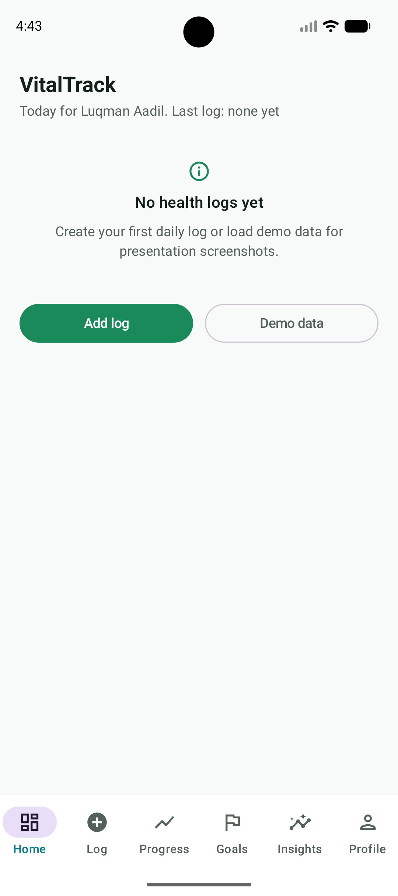
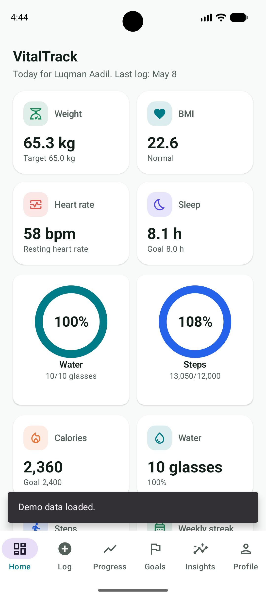
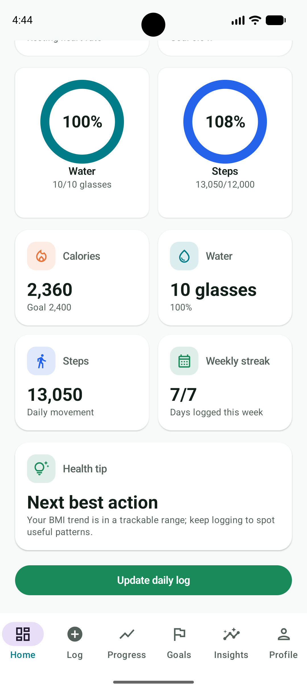
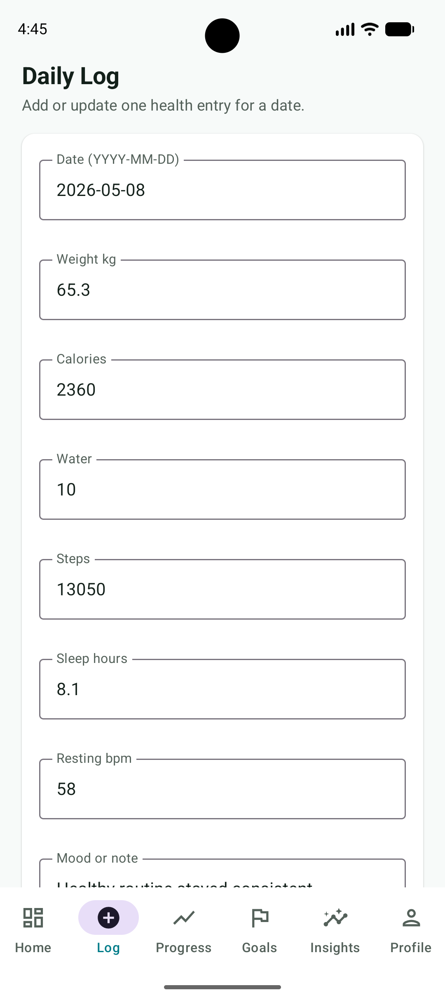
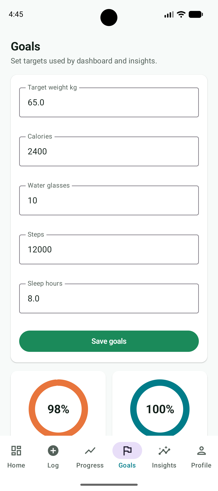
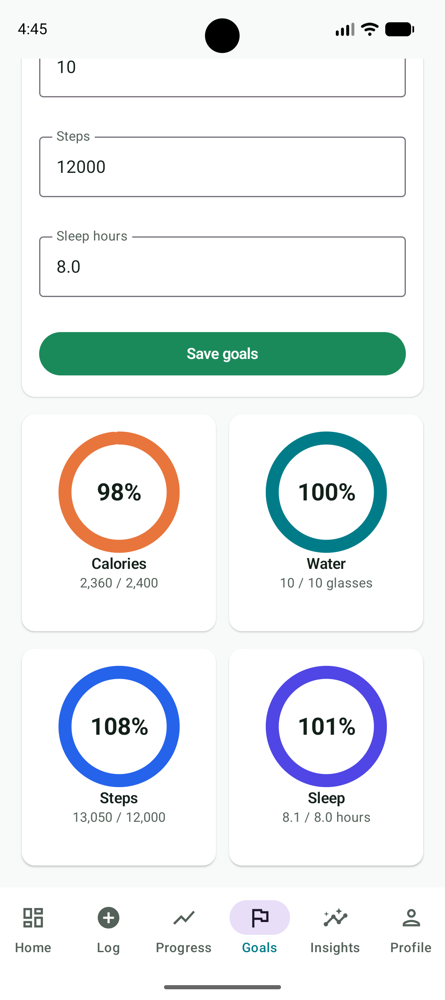
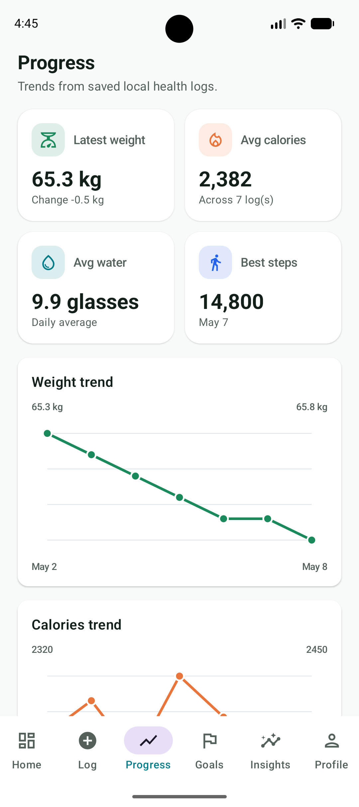
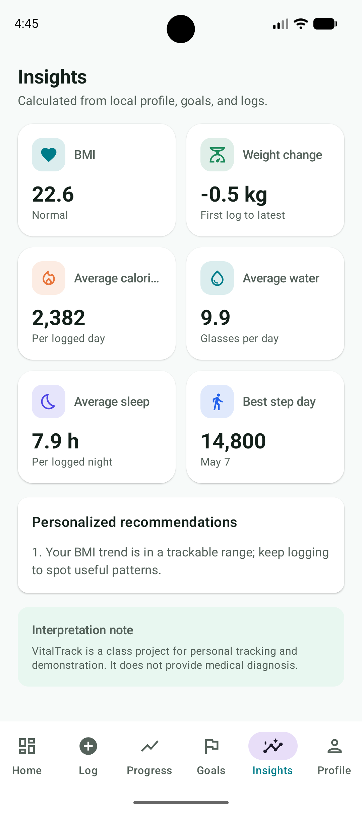
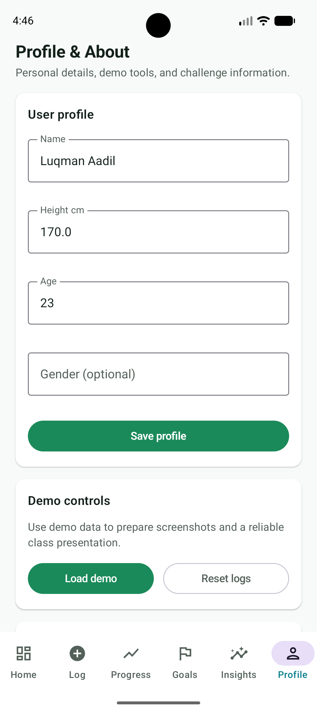

# VitalTrack - Health Monitoring App

**Course:** CS5450 Mobile Programming  
**Challenge:** Challenge 1  
**Assigned Group:** Group #1 - Health Monitoring App  
**Application:** VitalTrack  
**Repository:** <https://github.com/luqi101/Mobile_Programming_Challenge_1.git>

## Group Members

- Aadil, Luqman
- Eldelngaty, Abdelrahman M
- Omar Ali, Ahmed
- Anujin, Sainzolboo
- Arora, Pranay Rajesh
- Avaiya, Om Jayeshbhai
- Avecillas Segovia, Danilo Nicolas
- Juntao Wen

## Executive Summary

VitalTrack is a local-first health monitoring application developed as a native Android project for CS5450 Mobile Programming Challenge 1. The app supports daily health tracking, personal goals, health progress visualization, BMI-based insights, and demonstration-ready sample data. It is implemented with Kotlin, Jetpack Compose, and Material 3, matching the challenge requirement for a mobile Kotlin/Jetpack Compose application.

The application fits the Group #1 Health Monitoring App assignment by providing a complete health-tracking workflow: users can maintain daily logs, review a dashboard summary, set goals, inspect progress charts, and view personalized wellness insights. VitalTrack is intentionally local-only, which makes it reliable for classroom demonstration because it does not depend on login, cloud services, internet access, runtime permissions, Firebase, Health Connect, or a backend server.

## Challenge Alignment

VitalTrack satisfies the main Challenge 1 expectations through the following implementation choices:

- Native Android Studio project using Kotlin and Jetpack Compose.
- Multiple Compose screens with bottom navigation.
- Custom Material 3 styling with a health-focused green, teal, and blue palette.
- Professional dashboard, form, goal, progress, insight, and profile/about workflows.
- Local data persistence across app restarts.
- Demonstration data for screenshots and Zoom presentation readiness.
- Custom Compose Canvas charts with safe empty-data and one-point-data behavior.
- README, screenshots, GitHub repository link, and PDF documentation prepared for final submission.
- Full Android Studio project suitable for ZIP packaging and D2L upload.

## Technology Stack

The project uses only technologies present in the repository:

- Kotlin
- Android Studio project structure
- Gradle Kotlin DSL
- Jetpack Compose
- Material 3
- Compose Navigation
- AndroidX ViewModel
- Kotlin StateFlow
- SharedPreferences for local persistence
- Android SDK JSON APIs for defensive local serialization
- Compose Canvas for trend charts and progress rings
- JUnit and AndroidX test dependencies from the generated Android project

## Feature Overview

### Dashboard

The Dashboard provides an at-a-glance summary of the latest health log. It displays weight, BMI, resting heart rate, sleep, water progress, steps progress, calories, weekly logging consistency, and a health tip.

### Daily Log

The Daily Log screen allows the user to add or update one daily entry. The form tracks date, weight, calories, water glasses, steps, sleep hours, resting heart rate, and a short mood or note. Successful saves return to the Dashboard so the updated metrics are visible immediately.

### Goals

The Goals screen stores target weight, daily calories, daily water glasses, daily steps, and sleep target. It also compares the most recent daily log against the saved goals using progress ring cards.

### Progress And Charts

The Progress screen summarizes latest weight, average calories, average water, and best step day. It uses custom Compose Canvas charts for weight, calories, water, and steps trends.

### Insights

The Insights screen calculates BMI, BMI category, total weight change, average calories, average water intake, average sleep, best step day, and personalized recommendations based on the profile, goals, and latest log.

### Profile And About

The Profile/About screen stores the user's name, height, age, and optional gender. It also includes course/challenge context, demo controls, and a reset-logs confirmation workflow.

### Local Persistence

Health logs, goals, and profile data are persisted locally using SharedPreferences. Saved data remains available after the app restarts. Persistence parsing is defensive so malformed saved values do not crash the UI.

### Demo Data

The app includes demonstration data for a healthy, fit profile. The current demo profile uses Luqman Aadil, age 23, height 170 cm, a normal BMI, strong daily step counts, consistent sleep, healthy hydration, and fitness-oriented notes. This supports predictable screenshots and a reliable class presentation.

### Validation And Empty States

Numeric inputs are validated before saving. Invalid values produce clear messages instead of crashes. Screens and charts also handle empty data safely.

## Screenshots

The following screenshots are real captures stored in the repository under `screenshots/`.

### Dashboard - Empty State



Caption: Dashboard state before demo data is loaded, showing that empty health data is handled gracefully.

### Dashboard - Summary Metrics



Caption: Dashboard after demo data is loaded, including weight, BMI, heart rate, sleep, water, steps, and calories.

### Dashboard - Health Tip And Weekly Consistency



Caption: Dashboard lower section with progress rings, daily metrics, weekly streak, and a health recommendation.

### Daily Log



Caption: Daily Log form populated with a saved health entry for the selected date.

### Goals - Target Entry



Caption: Goals screen showing editable targets for weight, calories, water, steps, and sleep.

### Goals - Current Progress



Caption: Goal progress cards comparing the latest daily log with saved target values.

### Progress Charts



Caption: Progress screen with summary statistics and custom Compose Canvas trend charts.

### Insights



Caption: Insights screen with BMI, weight change, averages, best step day, and recommendation content.

### Profile And About



Caption: Profile/About screen with user profile fields, demo controls, and local data tools.

## Exact Project Structure

Generated and build output folders such as `.gradle/`, `.idea/`, `build/`, and `app/build/` are intentionally excluded.

```text
.
├── .gitignore
├── AGENTS.md
├── MC_Challange1_2026NN.pdf
├── README.md
├── README.pdf
├── build.gradle.kts
├── gradle.properties
├── gradlew
├── gradlew.bat
├── settings.gradle.kts
├── gradle/
│   ├── gradle-daemon-jvm.properties
│   ├── libs.versions.toml
│   └── wrapper/
│       ├── gradle-wrapper.jar
│       └── gradle-wrapper.properties
├── app/
│   ├── .gitignore
│   ├── build.gradle.kts
│   ├── proguard-rules.pro
│   └── src/
│       ├── main/
│       │   ├── AndroidManifest.xml
│       │   ├── java/com/example/healthmonitoringapp/
│       │   │   ├── MainActivity.kt
│       │   │   ├── VitalTrackApp.kt
│       │   │   ├── data/
│       │   │   │   ├── DemoDataFactory.kt
│       │   │   │   ├── HealthLog.kt
│       │   │   │   ├── UserGoals.kt
│       │   │   │   ├── UserProfile.kt
│       │   │   │   └── VitalTrackRepository.kt
│       │   │   ├── util/
│       │   │   │   ├── DateUtils.kt
│       │   │   │   ├── Formatters.kt
│       │   │   │   ├── HealthCalculations.kt
│       │   │   │   └── Validation.kt
│       │   │   ├── viewmodel/
│       │   │   │   ├── VitalTrackUiState.kt
│       │   │   │   ├── VitalTrackViewModel.kt
│       │   │   │   └── VitalTrackViewModelFactory.kt
│       │   │   └── ui/
│       │   │       ├── components/
│       │   │       ├── navigation/
│       │   │       ├── screens/
│       │   │       └── theme/
│       │   └── res/
│       ├── androidTest/
│       └── test/
├── docs/
│   ├── PROJECT_STRUCTURE.md
│   ├── README.md
│   └── SCREENSHOT_CHECKLIST.md
└── screenshots/
    ├── Screenshot_20260508_164612.png
    ├── Screenshot_20260508_164659.png
    ├── Screenshot_20260508_164708.png
    ├── Screenshot_20260508_164720.png
    ├── Screenshot_20260508_164732.png
    ├── Screenshot_20260508_164745.png
    ├── Screenshot_20260508_164749.png
    ├── Screenshot_20260508_164803.png
    └── Screenshot_20260508_164826.png
```

## Configuration And Setup

### Required Software

- Android Studio with Android SDK support.
- JDK compatible with the Gradle wrapper configuration.
- The included Gradle wrapper scripts: `./gradlew` for macOS/Linux and `gradlew.bat` for Windows.
- Android emulator or physical Android phone.

### Gradle And Project Details

- Root project name: `Health Monitoring App`
- Android application module: `app`
- Gradle DSL: Kotlin DSL
- Namespace/application ID: `com.example.healthmonitoringapp`
- Minimum SDK: 24
- Target SDK: 36
- Compile SDK: 36.1 as configured in `app/build.gradle.kts`

### Opening In Android Studio

1. Open Android Studio.
2. Select **Open**.
3. Choose the full project directory.
4. Allow Gradle sync to complete.
5. Select the `app` run configuration.
6. Choose an Android emulator or connected physical device.

## Run Instructions

### Android Studio

1. Open the project in Android Studio.
2. Wait for Gradle sync.
3. Start an emulator from Device Manager or connect a physical Android phone with USB debugging enabled.
4. Select the `app` run configuration.
5. Press **Run**.

### Command Line Build

From the project root:

```bash
./gradlew clean
./gradlew assembleDebug
```

The debug APK is generated at:

```text
app/build/outputs/apk/debug/app-debug.apk
```

### Optional Device Install

If an emulator or physical phone is connected:

```bash
./gradlew installDebug
```

### Emulator Notes

Use a recent Android emulator image. The app requires no internet permission, no user account, and no external services, so it is suitable for offline classroom demonstration.

### Physical Android Phone Notes

Enable Developer Options and USB debugging, connect the phone, accept the debugging prompt, and select the phone as the Android Studio run target.

## Demonstration Guide

This flow is suitable for a TA/instructor or Zoom presentation:

1. Launch VitalTrack and identify it as Group #1's health monitoring app.
2. Show the Dashboard, including the empty state or the loaded demo summary.
3. Open Daily Log and review the tracked fields: weight, calories, water, steps, sleep, heart rate, and note.
4. Save or update a log and return to the Dashboard to show updated values.
5. Open Goals and explain target weight, calories, water, steps, and sleep goals.
6. Open Progress and show the custom trend charts.
7. Open Insights and explain BMI, BMI category, averages, best step day, and recommendations.
8. Open Profile/About and show profile persistence, demo data, reset logs, and challenge information.
9. Explain that logs, goals, and profile data are saved locally and remain available after app restart.

## Software Design And Architecture

VitalTrack follows a simple ViewModel-based Compose architecture:

- `MainActivity.kt` starts the Compose application.
- `VitalTrackApp.kt` defines the Material 3 scaffold, snackbar host, and bottom navigation.
- `ui.navigation` contains destination definitions and the NavHost.
- `ui.screens` contains the six user-facing screen implementations.
- `ui.components` contains reusable metric cards, validated text fields, progress rings, empty states, and Canvas charts.
- `viewmodel` owns UI state through StateFlow and exposes actions for saving logs, goals, profile data, demo data, and reset confirmation.
- `data` contains Kotlin data models, demo seed data, and the SharedPreferences repository.
- `util` contains date utilities, formatting, health calculations, and validation rules.
- `ui.theme` defines the custom Material 3 color palette and typography.

This organization keeps state management, calculations, persistence, navigation, and screen rendering separate. The app is reliable for demonstration because all core features run locally without network calls, login, backend services, or runtime permissions.

## Testing And Verification

The following areas were verified during finalization:

- Gradle clean build.
- Debug APK assembly.
- Main bottom navigation across Dashboard, Daily Log, Progress, Goals, Insights, and Profile/About.
- Daily Log form validation and successful save behavior.
- Dashboard update after saving a daily log.
- Local persistence through SharedPreferences for logs, goals, and profile.
- Empty dashboard state before demo data is loaded.
- Demo data load flow.
- Reset logs confirmation.
- Charts with multi-point demo data.
- Scrollable layouts on phone-sized screenshots.

Final verification commands:

```bash
./gradlew clean
./gradlew assembleDebug
```

## Known Limitations

- VitalTrack is an academic prototype for CS5450 Challenge 1.
- It is not intended to provide medical diagnosis or medical advice.
- Data is stored locally on one device and does not sync across devices.
- The app does not integrate with wearables, Health Connect, or external sensors.
- The app intentionally avoids cloud login, Firebase, and backend services because the challenge focuses on Kotlin/Compose mobile app functionality.

## Submission Checklist

- Full Android Studio project included.
- `README.md` finalized at the project root.
- `README.pdf` generated at the project root.
- GitHub repository link included: <https://github.com/luqi101/Mobile_Programming_Challenge_1.git>
- Screenshots included in `screenshots/` and embedded in this README.
- Build verified with `./gradlew clean`.
- Debug APK verified with `./gradlew assembleDebug`.
- App prepared for emulator demonstration.
- App can be installed on a physical Android phone through Android Studio or `./gradlew installDebug`.
- Zoom/demo presentation flow documented in this README.
- Project ready to package as a ZIP for D2L upload.

## Academic Originality Note

VitalTrack is an original academic implementation prepared for CS5450 Mobile Programming Challenge 1. The app is built specifically for the assigned Group #1 Health Monitoring App topic using native Android, Kotlin, Jetpack Compose, and local-first data handling.
